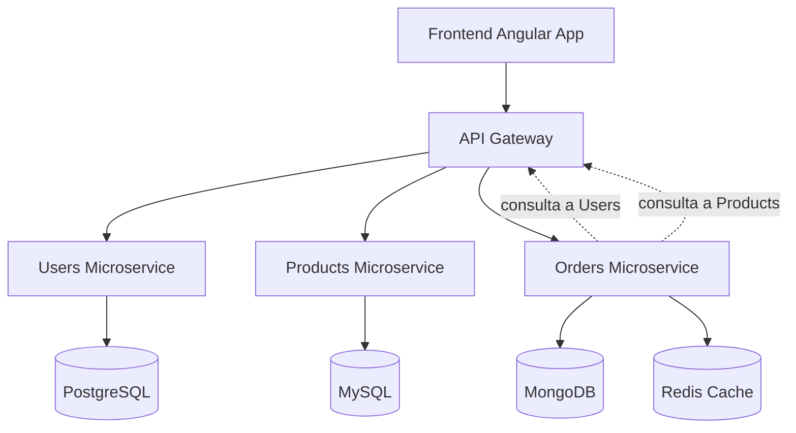

# 🧩 Proyecto de Microservicios

---

Este repositorio reúne un conjunto de **microservicios desarrollados en .NET 8** junto con un **cliente en Angular** y un **API Gateway**, organizados como submódulos y desplegados de forma unificada con **Docker Compose**.  

El objetivo del proyecto es **demostrar experiencia en arquitecturas distribuidas, integración de múltiples tecnologías, y despliegue automatizado** mediante contenedores.  

## 📂 Estructura del Proyecto

El repositorio principal incluye los siguientes submódulos:  

- **Users Microservice**  
  - Endpoints: login, registro, y obtención de información de usuario.  
  - Arquitectura: **Clean Architecture**  
  - Base de datos: **PostgreSQL**  
  - ORM: **Dapper**  
  - Funcionalidad: gestión de usuarios y autenticación.  

- **Products Microservice**  
  - Endpoints: CRUD de productos y búsqueda con filtros.  
  - Arquitectura: **Layered Architecture**  
  - Base de datos: **MySQL**  
  - ORM: **Entity Framework Core**  
  - Funcionalidad: administración del catálogo de productos.  

- **Orders Microservice**  
  - Endpoints: CRUD de órdenes.  
  - Arquitectura: **Layered Architecture**  
  - Base de datos: **MongoDB**  
  - Cache: **Redis**  
  - Funcionalidad: gestión de órdenes, comunicándose con *Users* y *Products* para obtener información detallada de usuarios y productos.  

- **API Gateway**  
  - Proyecto en **.NET 8** implementado con **Ocelot** que centraliza las peticiones hacia los microservicios.  
  - Funcionalidad: expone un punto de entrada unificado para el frontend y centraliza la comunicación entre microservicios, manejando el enrutamiento y simplificando el flujo de datos.  

- **Frontend (Angular App)**  
  - Aplicación cliente en **Angular** que consume los microservicios a través del API Gateway.  

## 🛠️ Tecnologías Utilizadas

- **Backend**: .NET 8, Dapper, Entity Framework Core, AutoMapper, FluentValidation, Ocelot 
- **Bases de Datos**: PostgreSQL, MySQL, MongoDB  
- **Cache**: Redis  
- **Frontend**: Angular  
- **Infraestructura & DevOps**: Docker, Docker Compose, Git Submodules  

## 🚀 Puesta en Marcha

1. Clonar el repositorio con todos los submódulos:  

        git clone --recurse-submodules https://github.com/DrizztDo21/Microservices.git

2. Levantar el entorno completo con Docker Compose (desde ./Microservices/Docker-compose):  

        docker-compose up -d

   Esto desplegará:  
   - Los tres microservicios  
   - El API Gateway   
   - El cliente en Angular
   - PostgreSQL, MySQL, MongoDB y Redis  
   - Scripts de inicialización de bases de datos  
   
3. Acceder a la aplicación:  

        http://localhost:4200
   

## 📐 Arquitectura

El sistema sigue un diseño de **microservicios desacoplados**, cada uno con su propia base de datos y responsabilidades, comunicados entre sí a través de HTTP y centralizados mediante un **API Gateway**.  
Redis se utiliza como **capa de cache** para optimizar el acceso a datos en *Orders*.  

## 🎯 Objetivo del Proyecto

- Demostrar experiencia en **arquitectura de microservicios**.  
- Aplicar distintos enfoques arquitectónicos: **Clean Architecture** y **Layered Architecture**.  
- Aplicar **Polyglot Persistence**, combinando bases de datos SQL y NoSQL según el dominio del microservicio. 
- Aplicar buenas prácticas con **AutoMapper**, **FluentValidation**, y patrones de desacoplamiento.  
- Centralizar la comunicación mediante un **API Gateway** en .NET 8.  
- Mostrar conocimientos en **contenedores y despliegue con Docker Compose**.

## 🧑‍💻 Skills Demonstrated

- Diseño e implementación de **microservicios desacoplados**.  
- Aplicación de **Clean Architecture** y **Layered Architecture** en .NET.  
- Desarrollo e integración de un **API Gateway** como punto de entrada único.  
- Trabajo con **bases de datos poliglotas (Polyglot Persistence)**: PostgreSQL, MySQL y MongoDB.  
- Implementación de **caching distribuido** con Redis.  
- Uso de **ORMs diferentes** según la necesidad: Dapper y Entity Framework Core.  
- Aplicación de buenas prácticas: AutoMapper, FluentValidation, DTOs, separación de capas.  
- Despliegue completo con **Docker Compose**, incluyendo microservicios, gateway, frontend y dependencias.  
- Gestión de repositorios con **Git Submodules**.  
- Desarrollo de **frontend en Angular** integrado con APIs REST.
